# Asynq-Hub 系统架构文档

> 版本: v1.0.0  
> 更新日期: 2026-01-26

## 📋 目录

- [系统概览](#系统概览)
- [核心架构](#核心架构)
- [技术栈](#技术栈)
- [目录结构](#目录结构)
- [核心模块](#核心模块)
- [数据流程](#数据流程)
- [部署架构](#部署架构)
- [性能优化](#性能优化)
- [安全设计](#安全设计)

## 系统概览

Asynq-Hub 是一个通用的分布式任务管理和队列系统，基于 Go 实现，提供：

- ✅ 分布式任务调度与执行
- ✅ 多队列优先级支持
- ✅ 任务失败重试机制
- ✅ 实时监控和统计
- ✅ Web UI 管理界面
- ✅ RESTful API 接口
- ✅ Worker SDK 快速集成

### 核心特性

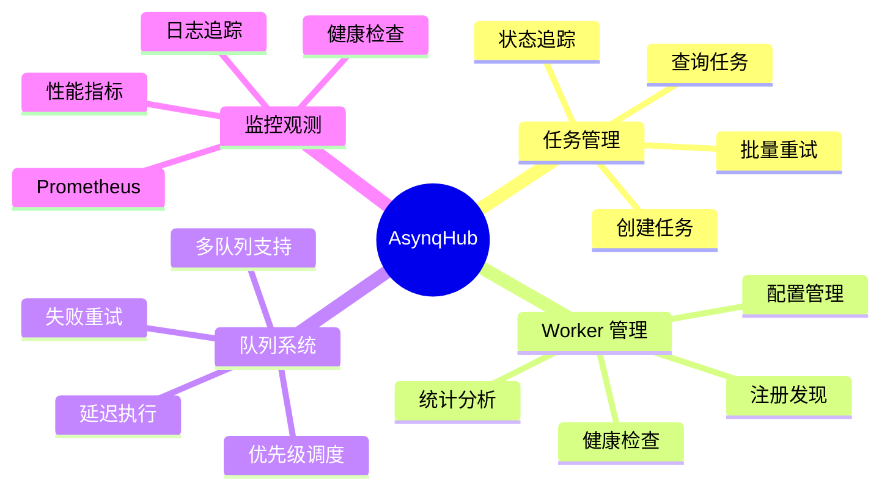

### 系统指标

| 指标 | 数值 |
|------|------|
| 代码行数 | ~7,200 行 (Go) |
| SDK 模块 | 7 个核心模块 |
| API 端点 | 18 个 RESTful 接口 |
| 数据库表 | 3 个 (Task, TaskAttempt, Worker) |
| 部署方式 | Docker / K8s / Helm |
| 并发能力 | 可配置 (默认 10) |

## 核心架构

### 整体架构图

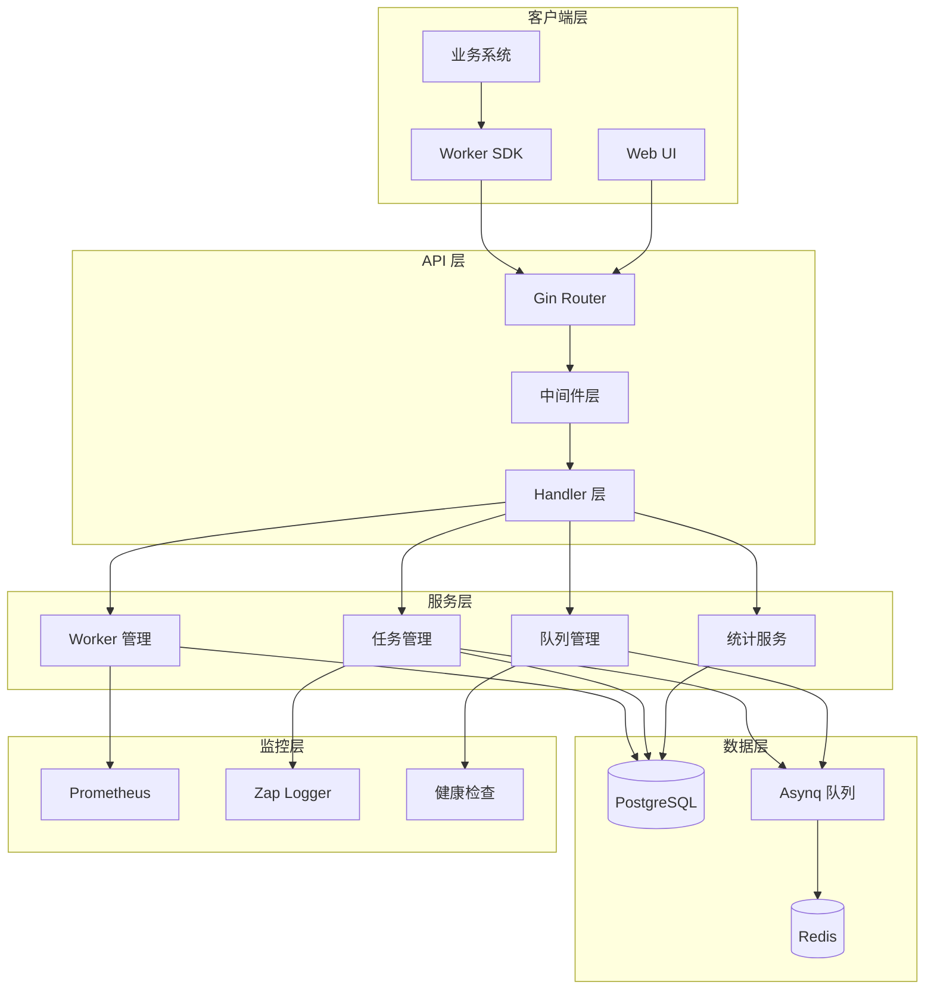

### 分层架构

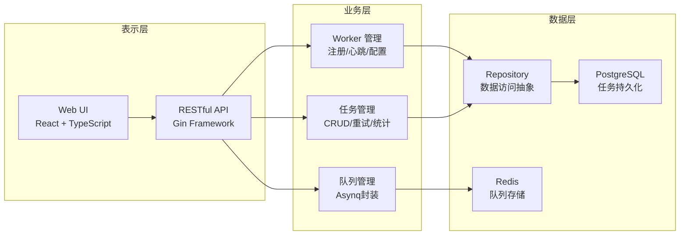

## 技术栈

### 后端技术

| 技术 | 版本 | 用途 |
|------|------|------|
| Go | 1.25 | 核心语言 |
| Gin | 1.11.0 | Web 框架 |
| Asynq | 0.25.1 | 任务队列 |
| PostgreSQL | 18 | 数据持久化 |
| Redis | 最新 | 队列存储 |
| pgx/v5 | 5.8.0 | PostgreSQL 驱动 |
| Zap | 1.27.1 | 结构化日志 |
| Prometheus | 1.23.2 | 监控指标 |
| Swaggo | 1.16.6 | API 文档 |

### 前端技术

| 技术 | 版本 | 用途 |
|------|------|------|
| React | 19.2.3 | UI 框架 |
| TypeScript | 5.9.3 | 类型安全 |
| Vite | 7.2.4 | 构建工具 |
| Tailwind CSS | 最新 | 样式框架 |
| shadcn/ui | 最新 | 组件库 |
| Recharts | 最新 | 图表库 |
| i18next | 最新 | 国际化 |

### 基础设施

| 组件 | 用途 |
|------|------|
| Docker | 容器化 |
| Docker Compose | 本地开发 |
| Kubernetes | 容器编排 |
| Helm | K8s 包管理 |
| Prisma | 数据库迁移 |
| pnpm | 前端包管理 |
| Make | 构建自动化 |
| GitHub Actions | CI/CD |

## 目录结构

```
asynq-hub/
├── cmd/                    # 可执行程序入口
│   ├── server/            # Asynq-Hub 服务端
│   │   ├── main.go        # 入口文件
│   │   └── webui/         # 嵌入的 Web UI
│   └── example/           # Worker 示例
│       └── main.go        # 示例代码
│
├── sdk/                   # Worker SDK (扁平化)
│   ├── client.go         # HTTP 客户端
│   ├── worker.go         # Worker 核心
│   ├── register.go       # 注册逻辑
│   ├── reliability.go    # 可靠性保障
│   ├── report.go         # 上报逻辑
│   ├── status.go         # 状态管理
│   └── task.go           # 任务处理
│
├── internal/              # 内部包
│   ├── server/           # HTTP 服务
│   │   ├── router.go     # 路由配置
│   │   ├── handler/      # 请求处理器
│   │   └── dto/          # 数据传输对象
│   ├── repository/       # 数据访问层
│   │   ├── repository.go # 接口定义
│   │   ├── task_repo.go  # 任务仓储
│   │   └── worker_repo.go # Worker 仓储
│   ├── queue/            # 队列管理
│   │   ├── client.go     # Asynq 客户端
│   │   ├── task.go       # 任务封装
│   │   └── redis.go      # Redis 配置
│   ├── worker/           # Worker 管理
│   │   └── store.go      # Worker 存储
│   ├── storage/          # 存储适配器
│   │   └── postgres/     # PostgreSQL
│   ├── middleware/       # 中间件
│   │   ├── validation.go # 参数验证
│   │   └── prometheus.go # 监控中间件
│   ├── config/           # 配置管理
│   ├── logger/           # 日志管理
│   ├── metrics/          # Prometheus 指标
│   ├── healthcheck/      # 健康检查
│   ├── cache/            # 缓存管理
│   └── model/            # 数据模型
│
├── web/                   # Web UI (可选)
│   ├── src/              # 源代码
│   │   ├── pages/        # 页面组件
│   │   ├── components/   # UI 组件
│   │   ├── locales/      # 国际化
│   │   └── hooks/        # React Hooks
│   ├── public/           # 静态资源
│   └── dist/             # 构建产物
│
├── deployments/          # 部署配置
│   ├── docker/          # Docker 配置
│   │   ├── Dockerfile.server
│   │   └── Dockerfile.example
│   ├── k8s/             # Kubernetes 配置
│   │   ├── base/        # 基础配置
│   │   └── overlays/    # 环境覆盖
│   └── helm/            # Helm Charts
│       └── asynq-hub/   # Helm 包
│
├── prisma/              # 数据库管理
│   ├── schema.prisma    # 数据库 Schema
│   └── migrations/      # 迁移脚本
│
├── docs/                # 文档
│   ├── ARCHITECTURE.md  # 架构文档
│   ├── swagger.yaml     # API 文档
│   └── docs.go          # Swagger 注解
│
├── scripts/             # 脚本工具
├── .github/             # GitHub 配置
│   └── workflows/       # CI/CD 流程
├── go.mod               # Go 模块定义
├── Makefile             # 构建脚本
├── docker-compose.yml   # Docker Compose
├── README.md            # 项目说明
└── CONTRIBUTING.md      # 贡献指南
```

## 核心模块

### 1. SDK 模块

Worker SDK 提供简单易用的任务处理能力：

```go
// 核心接口
type Worker interface {
    Start(ctx context.Context) error
    Stop() error
    HandleFunc(queue string, handler TaskHandler)
}

// 使用示例
worker := sdk.NewWorker(config)
worker.HandleFunc("default", func(ctx context.Context, payload json.RawMessage) error {
    // 处理任务
    return nil
})
worker.Start(context.Background())
```

**核心功能：**

- 自动注册和心跳
- 任务执行和重试
- 状态上报
- 可靠性保障

### 2. API 服务模块

RESTful API 提供完整的任务管理能力：

| 端点 | 方法 | 功能 |
|------|------|------|
| `/api/v1/workers` | GET | 获取 Worker 列表 |
| `/api/v1/workers/{name}/stats` | GET | Worker 统计信息 |
| `/api/v1/workers/{name}/timeseries` | GET | 时间序列数据 |
| `/api/v1/tasks` | POST | 创建任务 |
| `/api/v1/tasks` | GET | 查询任务列表 |
| `/api/v1/tasks/{id}` | GET | 获取任务详情 |
| `/api/v1/tasks/{id}/replay` | POST | 重放任务 |
| `/api/v1/tasks/batch-retry` | POST | 批量重试 |
| `/api/v1/queues/stats` | GET | 队列统计 |
| `/api/v1/queues/clear` | POST | 清空队列 |
| `/healthz` | GET | 存活检查 |
| `/readyz` | GET | 就绪检查 |
| `/metrics` | GET | Prometheus 指标 |
| `/swagger/*` | GET | API 文档 |

### 3. 队列管理模块

基于 Asynq 实现的分布式任务队列：

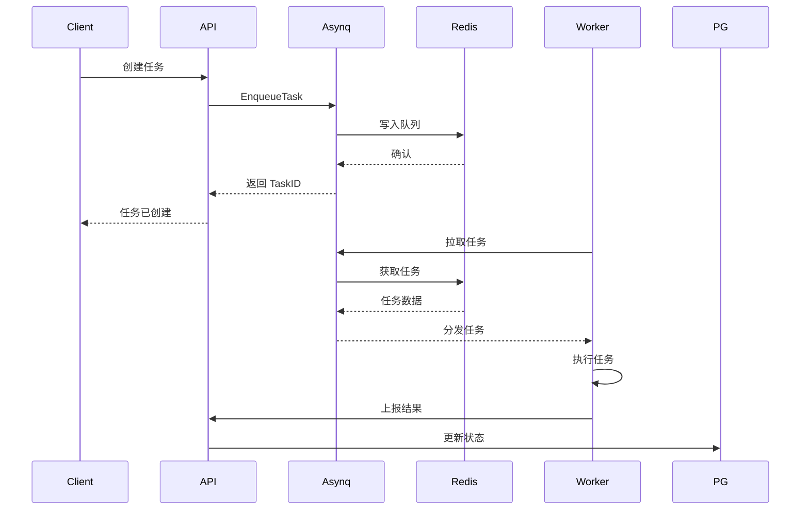

**队列特性：**

- 优先级调度
- 延迟执行
- 自动重试
- 死信队列
- 任务超时

### 4. 数据持久化模块

PostgreSQL 存储任务元数据和统计信息：

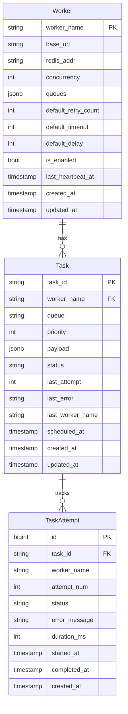

### 5. 监控观测模块

集成 Prometheus 和 Zap 日志：

**Prometheus 指标：**

- `asynqhub_http_requests_total` - HTTP 请求计数
- `asynqhub_http_request_duration_seconds` - 请求延迟
- `asynqhub_tasks_total` - 任务计数
- `asynqhub_tasks_duration_seconds` - 任务执行时间

**日志级别：**

- DEBUG - 调试信息
- INFO - 常规信息
- WARN - 警告信息
- ERROR - 错误信息
- FATAL - 致命错误

## 数据流程

### 任务创建流程

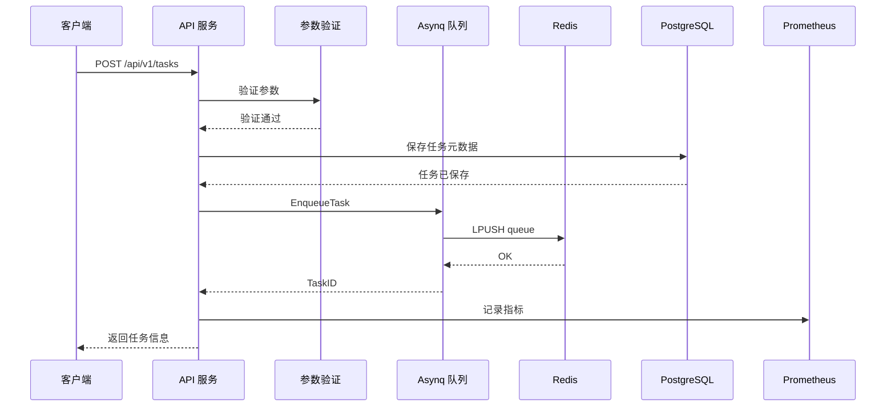

### 任务执行流程

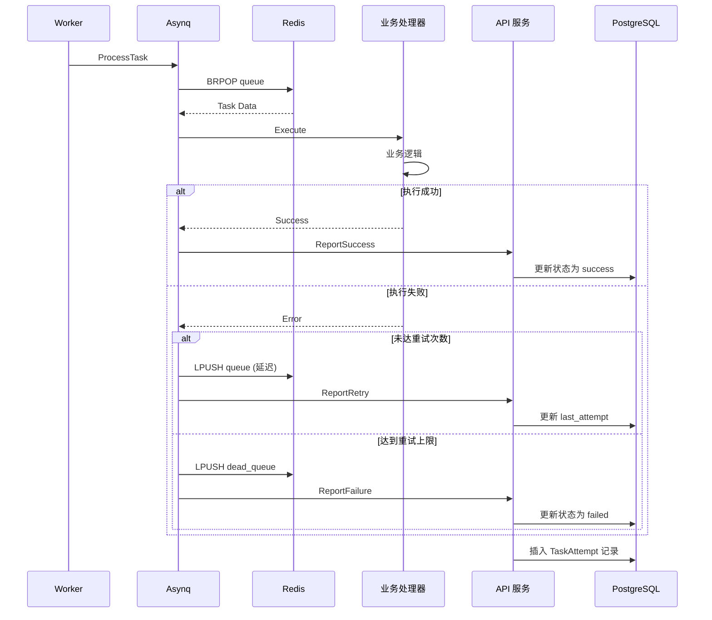

### Worker 注册流程

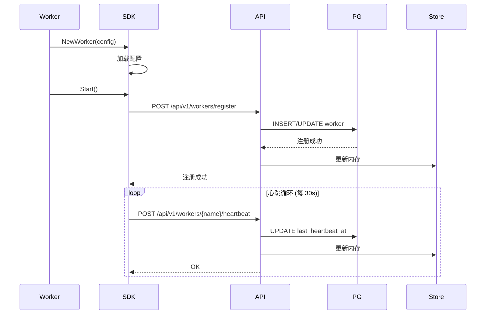

## 部署架构

### Docker Compose 部署

```yaml
services:
  asynqhub:
    image: asynqhub-server
    ports:
      - "28080:28080"
    environment:
      - DATABASE_URL=postgresql://...
      - REDIS_ADDR=redis:6379
    depends_on:
      - postgres
      - redis
  
  postgres:
    image: postgres:18
    ports:
      - "25432:5432"
  
  redis:
    image: redis:latest
    ports:
      - "16379:6379"
```

### Kubernetes 部署

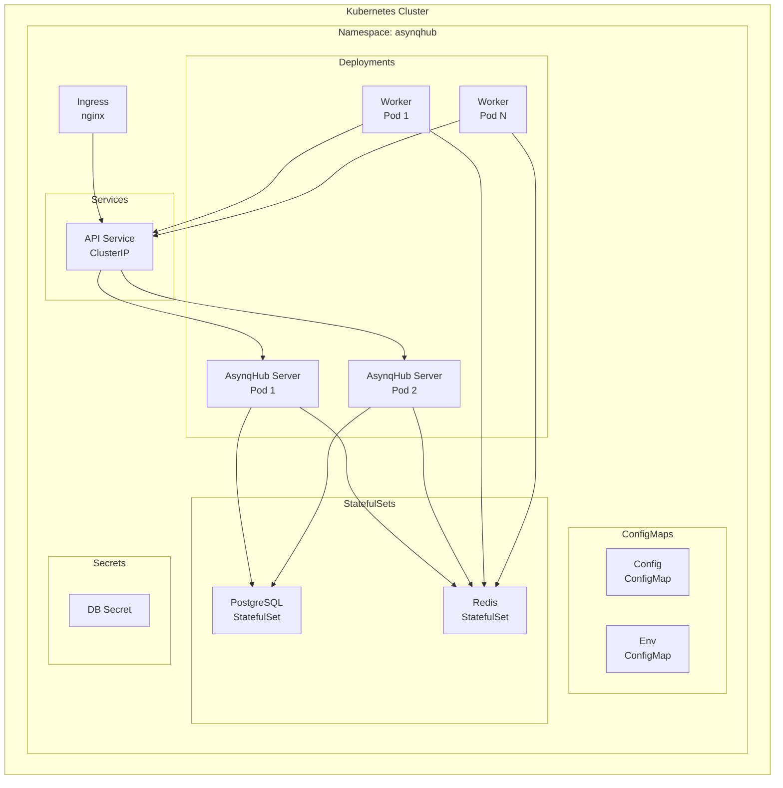

### 高可用架构

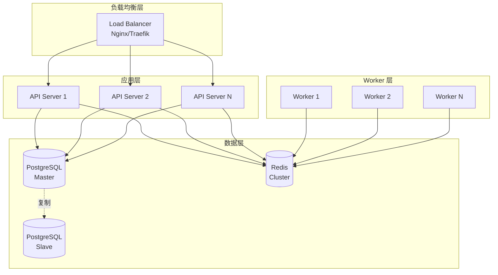

## 性能优化

### 1. 数据库优化

**索引策略：**

```sql
-- Task 表索引
CREATE INDEX idx_task_worker_status ON task(worker_name, status);
CREATE INDEX idx_task_created_at ON task(created_at DESC);
CREATE INDEX idx_task_queue ON task(queue);

-- TaskAttempt 表索引
CREATE INDEX idx_attempt_task_id ON task_attempt(task_id);
CREATE INDEX idx_attempt_worker_time ON task_attempt(worker_name, created_at DESC);

-- Worker 表索引
CREATE INDEX idx_worker_heartbeat_enabled ON worker(last_heartbeat_at DESC, is_enabled);
```

**查询优化：**

- 使用连接池 (pgxpool)
- 批量操作减少往返
- 预编译语句
- 只查询需要的字段

### 2. 缓存策略

**多级缓存：**

```
L1: 内存缓存 (Worker Store)
  ├── TTL: 5 分钟
  └── 用途: Worker 配置

L2: Redis 缓存
  ├── TTL: 30 分钟
  └── 用途: 统计数据、队列状态
```

### 3. 并发控制

- Asynq 并发配置
- PostgreSQL 连接池
- Gin 框架协程池
- Context 超时控制

### 4. 监控指标

```yaml
性能指标:
  - API 响应时间: < 100ms (P95)
  - 任务吞吐量: > 1000/s
  - 数据库连接: < 80% 使用率
  - Redis 延迟: < 1ms (P99)
  - CPU 使用: < 70%
  - 内存使用: < 2GB

可靠性指标:
  - 服务可用性: > 99.9%
  - 任务成功率: > 95%
  - 数据一致性: 100%
  - 故障恢复: < 30s
```

## 安全设计

### 1. API 安全

- **参数验证**: 严格的输入验证
- **速率限制**: 防止 API 滥用
- **CORS 配置**: 跨域请求控制
- **请求大小限制**: 2MB 上限

### 2. 数据安全

- **连接加密**: TLS/SSL 支持
- **敏感数据**: 环境变量存储
- **SQL 注入**: 参数化查询
- **日志脱敏**: 敏感信息过滤

### 3. 运维安全

- **健康检查**: Liveness/Readiness
- **优雅关闭**: 信号处理
- **资源限制**: CPU/内存限制
- **权限控制**: 最小权限原则

## 扩展性设计

### 水平扩展

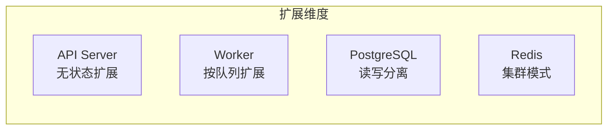

### 插件机制

- 自定义 Middleware
- 自定义 Handler
- 自定义 Repository
- 自定义 Metrics

---

## 附录

### A. 环境变量

| 变量名 | 说明 | 默认值 |
|--------|------|--------|
| `HTTP_PORT` | HTTP 端口 | 28080 |
| `DATABASE_URL` | PostgreSQL 连接 | - |
| `REDIS_ADDR` | Redis 地址 | localhost:6379 |
| `LOG_LEVEL` | 日志级别 | info |
| `GIN_MODE` | Gin 模式 | debug |

### B. 配置文件

```yaml
# config.yaml 示例
server:
  http_port: 28080
  grpc_port: 29090

database:
  host: localhost
  port: 5432
  name: asynqhub
  user: postgres
  password: secret
  max_connections: 25

redis:
  addr: localhost:6379
  db: 0

worker:
  concurrency: 10
  retry_count: 3
  timeout: 30
```

### C. 技术决策

| 技术选型 | 原因 |
|----------|------|
| Go | 高性能、并发支持好、部署简单 |
| Gin | 轻量级、性能优异、生态完善 |
| Asynq | 可靠的任务队列、基于 Redis |
| PostgreSQL | ACID 保证、丰富的查询能力 |
| Redis | 高性能、持久化支持 |
| React | 组件化、生态成熟 |
| Kubernetes | 容器编排标准、云原生 |

### D. 参考资料

- [Asynq 官方文档](https://github.com/hibiken/asynq)
- [Gin Web Framework](https://gin-gonic.com/)
- [PostgreSQL 文档](https://www.postgresql.org/docs/)
- [Prometheus 最佳实践](https://prometheus.io/docs/practices/)
- [Kubernetes 官方文档](https://kubernetes.io/docs/)

---

**文档维护**: 本文档由 Asynq-Hub 团队维护，如有问题请提交 Issue。
